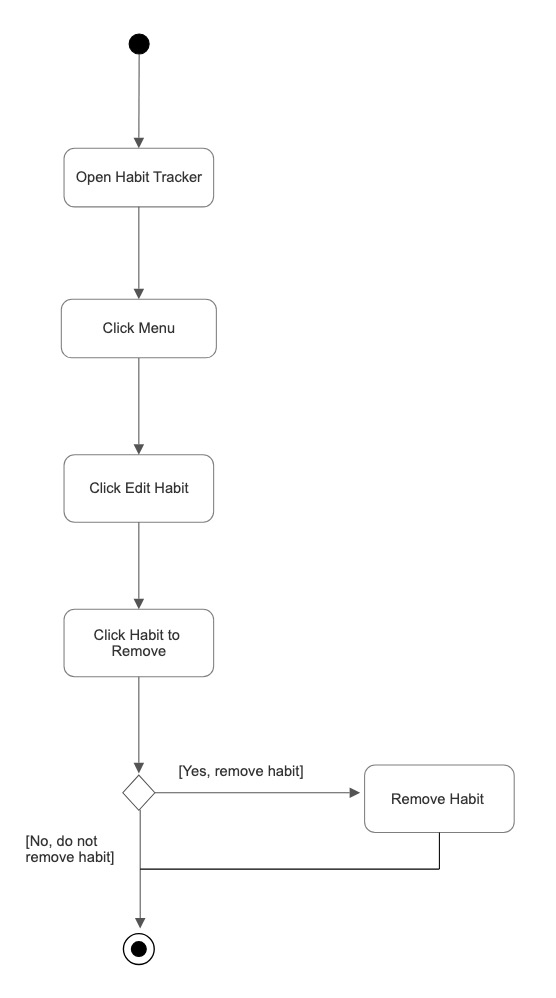
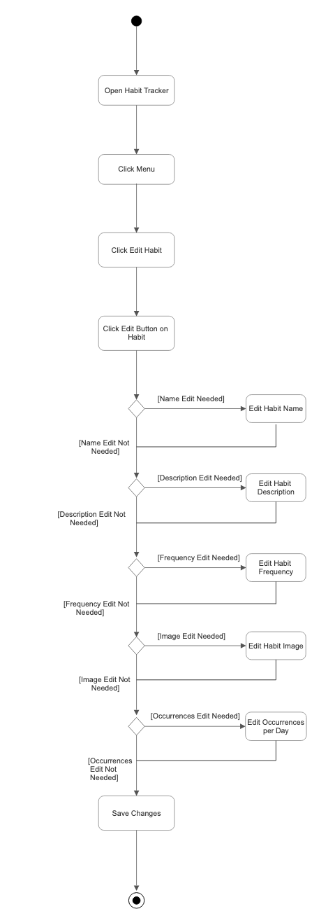

# Specification Phase Exercise

A little exercise to get started with the specification phase of the software development lifecycle. See the [instructions](instructions.md) for more detail.

## Team members

[Julia Ahn](https://github.com/juliaahn) 
[Sophia Schlichting](https://github.com/schlichtings) 
Wyatt Destabelle 
[Emily Ney](https://github.com/EmilyNey) 

## Stakeholders

#### Interview: Alison Evans, School Founder

**Goals and Needs:** 

- Stay on track and achieve goals
- Become more aware of behaviors to change or stop
- Use an app that:
  - Has clear directions
  - Is easy to use
  - Includes:
    - Widgets
    - Customizable notifications
    - Interactive elements (e.g., games)
    - Charts to visualize progress
    - Ability to share information with friends
    - Smartwatch integration
- Stay motivated through:
  - Internal decision-making (needs to find something important)
  - Visual progress and identifying patterns
  - Words of encouragement
- Have a "one-stop shop" for tracking multiple habits, instead of using different apps for:
  - Water intake
  - Weight
  - Exercise
  - Standing
  - Sleep
- Keep tracking engaging with:
  - Achievements
  - Option to watch an ad to revive a lost streak

**Problems and Frustrations:** 

- Apps that are not user-friendly
- Excessive reminders when missing a habit
- High costs of habit-tracking apps
- Losing motivation when running out of achievements
- Finds Apple’s built-in tracking tools boring
- Dislikes losing streaks in tracking apps
- Has tried to-do lists but gave up on them
- Would not use a notes or reflections feature

#### Interview: Anna Li, Finance Student

**Goals and Needs:** 

- Checkboxes
- Headings & colour coding to group assignments/subjects
- Calendar & list view
- Can use emojis

**Problems and Frustrations:** 

- Not much organization in notes app - all lists are in one note and it gets long
- In a planner I don't like when there are prompts to fill in
- Boring
- Not enough space or too much space given to fill things in

#### Interview: Raphael Huang, Student and Teaching Assistant

**Goals and Needs:** 

- Easy to check and check off habits, especially when lazy
  - As few gestures as possible between app opening and habit checking / checking off
- More likely to use if customizable, looks good
- Ability to track both once a day habits (i.g. making bed in the morning) and multiple times per day habits (i.g. brushing teeth)
- Visualization of consistency/ ability to view data on consistency of habit
- Customizable frequency for habits (once a week, every day, every tues/thurs, etc)
- Able to see what is 'up next' for the day, what habits still need to be completed

**Problems and Frustrations:** 

- Don't want to have to rewrite habits every night
- Doesn't want ways to 'cheat' habit system
- Doesn't want to spend more than a few minutes on the app per day
  - Bloat like notes or social features not only not helpful, but not welcome
- Allowing for 'one time habits' (grocery lists, etc) would clog up the app, make them less likely to use

#### Interview: Tanya Thakkar, Dental Student

**Goals and Needs:** 

- Wants to keep track water intake and how much she exercises
- Need to feel a sense of accomplishment by checking/crossing something off
- Wants to be held accountable by seeing how long she has kept a habit for
- Wants to be rewarded for having a long streak

**Problems and Frustrations** 

- Never found a habit tracker she has liked, so she has never tried
- Does not like when apps are boring/not easy to use

## Product Vision Statement

Our habit tracker application provides users with an easy and engaging way to achieve their goals by tracking their daily progress and maintaining streaks to help foster consistency and motivation.

## User Requirements

1. As a user, I want an application that is easy to use so that I continue to track my habits
2. As a user, I want an application that is aesthetically pleasing so that I continue to use the application
3. As a user, I want to check off my tasks so that I can feel accomplished.
4. As a user, I want to delete tasks so that I can keep my habits aligned with my goals
5. As a user, I want to be able to edit my habits so that I can keep them up to date and change them if needed.
6. As a user, I want to keep track of my daily habits so that I can help achieve my goals.
7. As a user, I want to keep track of my daily habits so that I can stay organized.
8. As a user, I want to see my progress for the day so that I can adjust my schedule accordingly.
9. As a user, I want to see my streak for completing a daily habit so that I can stay motivated to complete my habits everyday
10. As a user, I want to receive awards for my long streaks so that I can feel a sense of accomplishment when doing my habits for long periods of time.

## Activity Diagrams

#### Activity Diagram 1: based off of "As a user, I want to delete tasks so that I can keep my habits aligned with my goals"

#### Activity Diagram 2: based off of "As a user, I want to be able to edit my habits so that I can keep them up to date and change them if needed"

## Clickable Prototype

[Figma](https://www.figma.com/design/H70Jf8Pc0ZHEpe3BMvZBvR/SJWE_Project1?node-id=0-1&t=yoExYij4sZ6LjhrM-1)
